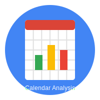
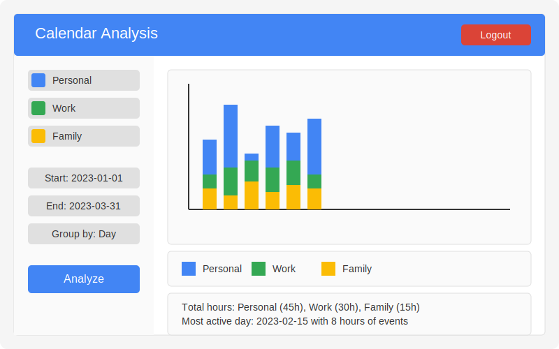

# Calendar Analysis App 📊

<div align="center">
  
  <br><br>
  
  [](https://opensource.org/licenses/MIT)
  [](https://www.ruby-lang.org/en/)
  [](http://sinatrarb.com/)
  [](https://developers.google.com/calendar)
</div>

A Ruby-based web application that provides analytics and visualization of your Google Calendar events. Track how you spend your time across different calendars with day, week, and month views.

<p align="center">
  
</p>

## 🌟 Features

- **📅 Google Calendar Integration**: Connect your Google account and analyze events across multiple calendars
- **⏱️ Flexible Time Analysis**: Group your calendar data by day, week, or month
- **📊 Visual Analytics**: View your time usage with interactive charts
- **🌙 Multi-day Event Handling**: Properly handles events that span across midnight
- **🔐 Secure Authentication**: Uses OAuth 2.0 for secure access to your Google account

## 🚀 Setup

### Prerequisites

- Ruby 2.7 or higher
- Bundler gem
- Google Cloud Platform account with Calendar API enabled
- Google OAuth 2.0 credentials (client ID and client secret)

### Installation

1. Clone the repository:

   ```bash
   git clone <repository-url>
   cd timer
   ```

2. Install dependencies:

   ```bash
   bundle install
   ```

3. Set up environment variables:

   ```bash
   export GOOGLE_CLIENT_ID=your_client_id
   export GOOGLE_CLIENT_SECRET=your_client_secret
   export REDIRECT_URI=https://your-domain.com/auth/google_oauth2/callback
   ```

4. Start the application:

   ```bash
   ruby app.rb
   ```

5. Open your browser and navigate to `http://localhost:4567`

## 📱 Usage

1. Sign in with your Google account
2. Select the calendars you want to analyze
3. Choose a date range for analysis
4. Select grouping method (day, week, or month)
5. Click "Analyze" to generate visualizations

<details>
<summary>📦 Docker Deployment</summary>

1. Build the Docker image:

   ```bash
   docker build -t calendar-analyzer .
   ```

2. Run the container:
   ```bash
   docker run -p 4567:4567 \
     -e GOOGLE_CLIENT_ID=your_client_id \
     -e GOOGLE_CLIENT_SECRET=your_client_secret \
     -e SESSION_SECRET=random_session_secret \
     -e REDIRECT_URI=your_redirect_uri \
     calendar-analyzer
   ```
</details>

## 🏗️ Architecture

| Component | Technology |
|-----------|------------|
| **Backend** | Sinatra (Ruby) |
| **Data Source** | Google Calendar API |
| **Visualization** | Chart.js |
| **Date Handling** | ActiveSupport |
| **Authentication** | OAuth2 |

## ⚠️ Troubleshooting

- **Session Issues**: Use the "Reset Session" button if you encounter authentication problems
- **OAuth Errors**: Ensure your redirect URI matches exactly what's configured in Google Cloud Console
- **Date Range Errors**: Start date must be before end date, and end date cannot be in the future

## 📝 License

MIT License

## 👨‍💻 Contributors

- [ttuan](https://github.com/ttuan)

---

<p align="center">
  Made with ❤️ by <a href="https://github.com/ttuan">ttuan</a>
</p>

